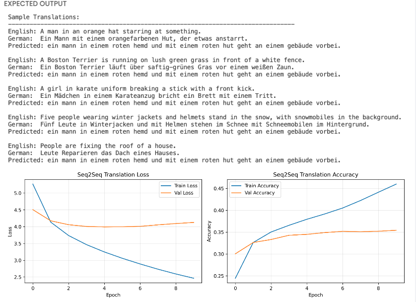

# MACHINE TRANSLATION SYSTEM USING SEQUENCE-TO-SEQUENCE ARCHITECTURE

## PROBLEM STATEMENT
A research team working on natural language processing requires an automated translation system to convert English text descriptions into German equivalents[cite: 1]. The team has access to a parallel corpus of image captions in both languages[cite: 1]. They need a developer to build a neural machine translation model that can learn the mapping between English and German sentence structures and generate accurate translations for unseen English sentences[cite: 1].

---

## OBJECTIVE
The developer is tasked with implementing a sequence-to-sequence encoder-decoder architecture using recurrent neural networks to perform English-to-German translation[cite: 1]. The system should process variable-length input sentences, learn contextual representations, and generate grammatically coherent German translations through an auto-regressive decoding process[cite: 1].

---

## DATASET DESCRIPTION
The developer receives the Multi30k dataset, which contains parallel English-German sentence pairs describing visual scenes[cite: 1]. The dataset is pre-split into three subsets:

* **Training Set:** 29,000 sentence pairs for model learning[cite: 1]
* **Validation Set:** 1,014 sentence pairs for hyperparameter tuning and monitoring[cite: 1]
* **Test Set:** 1,000 sentence pairs for final evaluation[cite: 1]

Each sentence pair consists of an English source sentence and its corresponding German target translation[cite: 1]. The sentences are descriptive captions of images, covering diverse scenarios including people, objects, activities, and locations[cite: 1]. The data is provided in plain text format with one sentence per line, where corresponding line numbers in English and German files represent translation pairs[cite: 1].

### Sample Data Examples
* **English:** "Two young, White males are outside near many bushes."[cite: 1]  
  **German:** "Zwei junge weiße Männer sind im Freien in der Nähe vieler Büsche."[cite: 1]
* **English:** "A little girl climbing into a wooden playhouse."[cite: 1]  
  **German:** "Ein kleines Mädchen klettert in ein Spielhaus aus Holz."[cite: 1]

### Dataset Download Details
[Deep_Learning_Dataset_Download_Details](https://examly467.sharepoint.com/sites/Iamneo.courseresources/Shared%20Documents/Forms/AllItems.aspx?id=%2Fsites%2FIamneo%2Ecourseresources%2FShared%20Documents%2FDeep%5FLearning%5FDataset%5FDownload%5FDetails%2FWeek5%5FDay1%5FSession3%5FQ1&viewid=f4caf78b%2Db897%2D4200%2Da01d%2D0d21213859ed&p=true&ga=1&LOF=1)[cite: 1]

---

## TASKS

### Task 1: Data Loading and Preprocessing
The developer must load the parallel corpus from separate English and German text files for training, validation, and test sets[cite: 1]. Each file contains one sentence per line with corresponding translations aligned by line number[cite: 1].

For the target German sequences, special tokens must be added to mark the beginning and end of each sentence[cite: 1]. This involves prepending a start token and appending an end token to every German sentence, which enables the decoder to learn when to begin and terminate the generation process[cite: 1].

### Task 2: Text Tokenization and Vocabulary Building
The developer needs to create separate tokenization systems for English and German languages[cite: 1]. Each tokenizer must analyze the training corpus to build a vocabulary of unique words, assign integer indices to each word, and handle out-of-vocabulary words encountered during inference[cite: 1].

The tokenization process should preserve all characters including punctuation marks without applying standard filtering[cite: 1]. Each tokenizer must convert text sentences into sequences of integer indices based on the learned vocabulary mappings[cite: 1].

### Task 3: Sequence Padding and Formatting
All input and output sequences must be standardized to a fixed maximum length through padding[cite: 1]. Sequences shorter than the maximum length should be padded with zeros at the end, while longer sequences should be truncated[cite: 1].

For training the decoder with teacher forcing, two versions of the German sequences are required[cite: 1]. The decoder input should contain all tokens except the last one, while the decoder output should contain all tokens except the first one[cite: 1]. This alignment ensures that at each time step, the model predicts the next token given all previous tokens[cite: 1].

### Task 4: Encoder Architecture Implementation
The developer must construct the encoder component which processes English input sentences[cite: 1]. The architecture begins with an embedding layer that converts integer token indices into dense vector representations of fixed dimensionality[cite: 1].

These embeddings are fed into a recurrent LSTM layer configured to return the final hidden state and cell state after processing the entire input sequence[cite: 1]. These state vectors capture the contextual information of the source sentence and serve as the initial states for the decoder[cite: 1].

### Task 5: Decoder Architecture Implementation
The decoder component must be designed to generate German translations token by token[cite: 1]. It starts with an embedding layer for German tokens, followed by an LSTM layer that accepts the encoder's final states as initial states[cite: 1].

The decoder LSTM must be configured to return sequences at every time step rather than just the final output[cite: 1]. These sequential outputs are passed through a dense layer with softmax activation to produce probability distributions over the German vocabulary at each decoding step[cite: 1].

### Task 6: Model Compilation and Training
The complete sequence-to-sequence model must be constructed by connecting the encoder inputs and decoder inputs to the decoder outputs[cite: 1]. The developer should configure the model with an appropriate optimizer and loss function suitable for multi-class classification over the vocabulary space[cite: 1].

Training should be performed using the prepared training data with the encoder receiving English sequences and the decoder receiving German input sequences while predicting German output sequences[cite: 1]. Validation data must be used to monitor the model's generalization performance across multiple training epochs[cite: 1].

### Task 7: Tokenizer Serialization
After training, both the English and German tokenizers must be saved to disk in a serialized format[cite: 1]. This preservation of tokenizers ensures that the same vocabulary mappings and configurations can be loaded during inference without requiring access to the original training data[cite: 1].

### Task 8: Inference Model Construction
The developer must create separate inference-time models for the encoder and decoder[cite: 1]. The encoder inference model should accept an input sentence and return the context state vectors[cite: 1].

The decoder inference model must be designed to operate in single-step mode, accepting one token at a time along with the previous hidden states, and returning the prediction probabilities along with updated states[cite: 1]. The weights from the trained decoder must be transferred to this inference model while maintaining separate computational graphs[cite: 1].

### Task 9: Translation Function Implementation
An auto-regressive translation function must be implemented that orchestrates the inference process[cite: 1]. The function should first encode the input English sentence to obtain context states, then initialize the decoder with a start token[cite: 1].

The generation process continues iteratively where at each step the decoder predicts the most likely next token, which is fed back as input for the subsequent step[cite: 1]. This loop continues until the decoder generates an end token or reaches the maximum sequence length[cite: 1]. Special tokens should be filtered from the final output[cite: 1].

### Task 10: Model Evaluation and Visualization
The developer should test the trained model on sample sentences from the test set, displaying the original English input, the reference German translation, and the model's predicted translation for qualitative assessment[cite: 1].

Training history metrics including loss and accuracy for both training and validation sets must be visualized using line plots across epochs[cite: 1]. These plots should be saved as image files for documentation and analysis of the model's learning progression and potential overfitting behavior[cite: 1].

---

## TECHNICAL SPECIFICATIONS

* **Maximum Sequence Length:** 20 tokens[cite: 1]
* **Embedding Dimension:** 256[cite: 1]
* **LSTM Hidden Units:** 512[cite: 1]
* **Batch Size:** 64[cite: 1]
* **Training Epochs:** 10[cite: 1]
* **Optimizer:** Adam[cite: 1]
* **Loss Function:** Sparse Categorical Crossentropy[cite: 1]
* **Evaluation Metric:** Accuracy[cite: 1]
* **Padding Strategy:** Post-padding with zeros[cite: 1]
* **Vocabulary:** Built from training corpus with out-of-vocabulary token support[cite: 1]
* **Decoding Strategy:** Greedy decoding (argmax at each step)[cite: 1]

---

## DELIVERABLES

1. **Visualization Plot:** Showing training and validation loss curves across epochs[cite: 1].
2. **Visualization Plot:** Showing training and validation accuracy curves across epochs[cite: 1].
3. **ANALYSIS REPORT:**
   * **Filename:** `ANALYSIS.txt` or `ANALYSIS.pdf`[cite: 1]
   * **Description:** Model performance analysis[cite: 1]
   * **Length:** 300–400 words[cite: 1]